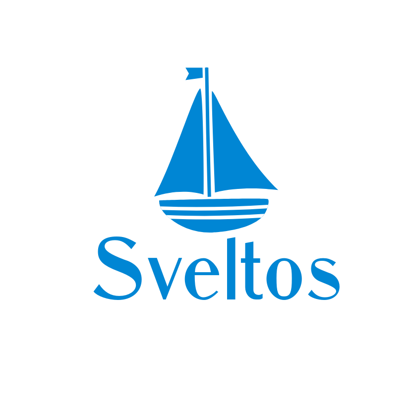

# Welcome to Sveltos - A Feature Manager for K8s Clusters

[Sveltos](https://github.com/projectsveltos/sveltos-manager) is a tool for policy driven management of features and resources in ClusterAPI powered Kubernetes clusters. Sveltos extends the functionality of ClusterAPI (CAPI) to add management of Kubernetes resources and Helm charts. Sveltos is a lightweight, freely available open source project that can be installed on a Kubernetes cluster in minutes.
